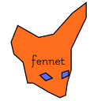

## fennet

Simple, fast, lightweight HTTP server library for C.


Fennet is a dependency-less library, it uses the native networking (socket) libraries for it's networking solution.

That, combined with a bs-less approach, makes it blazingly 🦊🚀🦊🚀🦊🚀 fast!


### Getting started with fennet:
To get up and running clone fennet's git repository:
```sh
git clone https://github.com/beProsto/fennet
```
If you want to generate the doxygen documentation on your own machine, clone recursively (`--recurse-submodules`) for the theme.

To build fennet, along with it's examples, use:
```sh
make
```
**or**
```sh
cmake -B ./build
cmake --build ./build
```

Everything should work out fine, now you can check out the examples and see how fennet works for yourself!